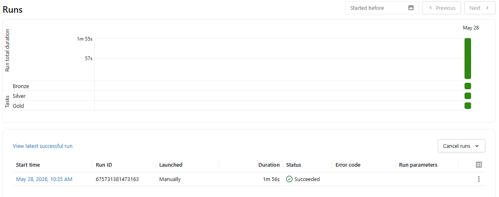
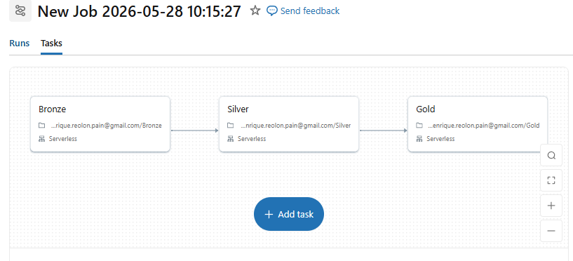
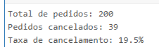

# Projeto_03 — Lakehouse com Arquitetura Medallion

Pipeline de dados construído no Databricks Community Edition como parte do desafio da Comunidados,
simulando o ambiente de engenharia de dados de um e-commerce de produtos eletrônicos e móveis (TechVenda).
Os objetivos eram responder as perguntas:
- Qual o faturamento total por mês em 2024?
- Quais vendedores geraram mais receita?
- Quais os produtos mais vendidos por categoria?
- Qual a taxa de cancelamento de pedidos?

## Arquitetura

A solução segue o padrão Medallion com três camadas:

- **Bronze** — Ingestão bruta dos arquivos CSV para Delta Tables, sem transformações
- **Silver** — Limpeza, tipagem, joins entre tabelas e cálculo de valor por item com desconto
- **Gold** — Visões analíticas agregadas para responder perguntas de negócio

## Orquestração

Os notebooks são executados em sequência via Databricks Workflow:

`Bronze → Silver → Gold`

&

## Outputs

### Gold 1 — Faturamento Mensal

### Gold 2 — Ranking de Vendedores

### Gold 3 — Top Produtos por Categoria

### Gold 4 — Taxa de Cancelamento de Pedidos

## Tecnologias

- Databricks Community Edition
- PySpark
- Delta Lake
- Unity Catalog (Volumes)

#### Obs: Minha primeira experiência com o databricks e fiquei surpreso com a quantidade funcionalidades, pretendo me aprofundar mais na plataforma no futuro 🐞
